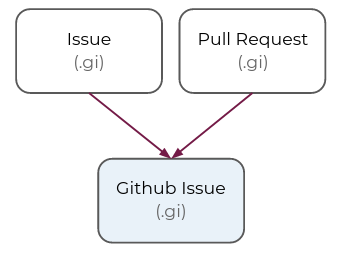
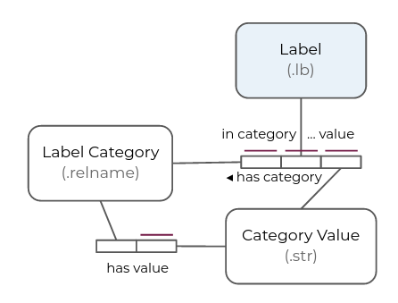

# Github Issue Tracking

Github Issues Tracking uses the power of knowledge graphs to model how production-scale software development can be tracked and important insights into productivity can be derived. Starting from raw data related to how our team contributes code, tracked via Github, we build a knowledge graph that destills behavior trends and development progress into easy-to-consume visualizations. Finally, we discuss how the insights gained inform how we manage projects and plan our product roadmap.

## What is Github?

Github is a platform for code development, including services for hosting, maintaining, and reviewing code as well as project tracking and management tools. Projects are stored in repositories, with git as the central tool for source code management and version control. *TO DO: Something about popularity.*

## Github concepts as a knowledge graph

What does Github data look like as a knowledge graph? One type of node, or **entity**, we consider is the members of our team--the **user** which contributes to the code base. Designed with collaboration in mind, git and Github support many users working together.

There are other types of entities we would like to track. Code bases are stored in a **repository** (or repo for short), and contributions to a repo may be tied to a **milestone** or an **issue** (or several). An issue is a write-up that can detail anything from bugs that need to be fixed to new features to be added. New code is added through a process called a **pull request**, in which a set of changes to the codebase are reviewed, tested, and merged together with the existing codebase. Both issues and pull requests can be tagged with a **label** (or several) that describe the nature of the issue, or what issue the pull request addresses.

The nodes of our graph are instances of these entities: Repository, Milestone, Issue, Pull Request, Label. The instances populate our knowledge graph and are linked together. For example, most of the attributes of an Issue and a Pull Request are the same, so we can consider them as subtypes of a single entity, which we'll call a Github Issue. Represented as an Object Role Modeling (ORM) diagram, this relationship looks like,

<!--img src="https://raw.githubusercontent.com/RelationalAI/crhunt/2caa2704bfd68a6d45526e02e44252d34bde4935/projects/github_issues/notebooks/images/GI_has_label_Label.png?token=AIME7RT7DVRZ65RF5JK6S5DBSLL7M"/-->



Each Github Issue has one or more Labels. In ORM this relationship looks like,


In Rel, we represent the "has label" relationship between issues and labels as a relation, `github_issue:has:label`. The ORM diagram above encodes the fact that `github_issue:has:label` is keyed by Github Issue entity instances and returns the Label entity instances that are associated with that Github Issue. This fact is a *constraint* on the content of the relation `github_issue:has:label`, and Rel is powerful at expressing data integrity constraints explicitly:

```
ic { github_issue:has:label ⊆ (GithubIssue, Label) }
```

In words, the values of `github_issue:has:label` must be a subset (⊆) of combinations of one Github Issue entity instance key and one Label entity instance value.

> !! TO DO: change `github_issue:label` to `github_issue:has:label` in the model.

## From data to graph

The Github API provides a slew of descriptive information about each of our entities of interest, formatted as a JSON-like dense data representation. For example, here are some example entries for labels, taken from the [API documentation](https://docs.github.com/en/rest/reference/issues#labels),

```
[
  {
    "id": 208045946,
    "node_id": "MDU6TGFiZWwyMDgwNDU5NDY=",
    "url": "https://api.github.com/repos/octocat/Hello-World/labels/bug",
    "name": "bug",
    "description": "Something isn't working",
    "color": "f29513",
    "default": true
  },
  {
    "id": 208045947,
    "node_id": "MDU6TGFiZWwyMDgwNDU5NDc=",
    "url": "https://api.github.com/repos/octocat/Hello-World/labels/enhancement",
    "name": "enhancement",
    "description": "New feature or request",
    "color": "a2eeef",
    "default": false
  }
]
```

Attributes like "name", "description", and "color" can be pulled directly into our model. Here is the code that does it,

```
def label:has[attr](lb,v) = json_label[lb,attr](v) and
    supported_attributes:label(attr) and
    Label(lb)
```

We build the set of relations `label:has` and populate them with any attribute we choose to support (`supported_attributes:label(attr)`) and pull the attribute values from the JSON data we've inserted (`json_label[lb,attr](v)`) which we've modified to be keyed by instances of the Label entity (`Label(lb)`). With the definition above, and a model populated by the example data, if we query `label:has:name` we would return,

| Key | Value |
| --- | ----------- |
| (unique hash) | "bug" |
| (unique hash) | "enhancement" |

The entity instances are unique hashes generated by Rel. Entities can be defined by specifying a set of attributes that make an entity instance unique. In this case, the Github API provides one for us, the "node_id",

```
entity Label has_label_id = json_labels[_][:[], _, :node_id]
```
And we map the inserted data to the labels thus,
```
def json_label[lb] = json_labels[repo][:[], i]
    from i, repo where has_label_id[ json_labels[repo][:[], i, :node_id] ](lb)
```

> !! TO DO: `json_label` and `json_labels` should have less similar names

Rel is more than simply a querying language. We can build out our model with complex calculations as well, keeping all of our data and logic in one place. For example, our model includes relations like `label:duration:percentile` which for a given percentile value, calculates the duration that a Github Issue remains open. The result can also be filtered by Issue or Pull Request. The relation is *inlined* which means it is only calculated when demanded during a query. Similarly, `label:duration:agg` can be used to calculate aggregations of the duration, such as the mean or standard deviation.

## How does issue label impact issue resolution time?

Does the duration an issue is open depend on its priority? On whether it addresses a bug or new feature?

```
query cell result
```

The knowledge graph is designed to parse label strings and generate relations based on the label values. Our product repository includes labels like "priority:high" and "type:bug", which become relations like `label:in:priority` and `label:in:type`, where the keys are label instances and the values are the string values of the label, in our example "high" and "bug" respectively.



The logic to parse the labels can be easily customized to other repository label naming conventions, and all of the string processing happens right in your model, without relying on data produced by opaque analyses elsewhere.

