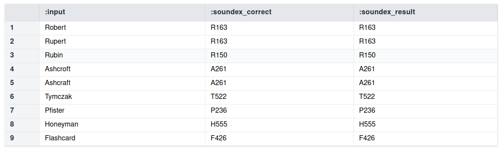

# Soundex

## What is Soundex?

From Wikipedia:

> Soundex is a phonetic algorithm for indexing names by sound, as pronounced in English. The goal is for homophones to be encoded to the same representation so that they can be matched despite minor differences in spelling.

> The algorithm mainly encodes consonants; a vowel will not be encoded unless it is the first letter. Soundex is the most widely known of all phonetic algorithms (in part because it is a standard feature of popular database software such as [...] SQL.

## Rules for Soundex enocoder

The rules are as follows:

1. Retain the first letter of the name and drop all other occurrences of a, e, i, o, u, y, h, w.
2. Replace consonants with digits as follows (after the first letter):
   - b, f, p, v → 1
   - c, g, j, k, q, s, x, z → 2
   - d, t → 3
   - l → 4
   - m, n → 5
   - r → 6
3. If two or more letters with the same number are adjacent in the original name (before step 1), only retain the first letter; also two letters with the same number separated by 'h' or 'w' are coded as a single number, whereas such letters separated by a vowel are coded twice. This rule also applies to the first letter.
4. If you have too few letters in your word that you can't assign three numbers, append with zeros until there are three numbers. If you have four or more numbers, retain only the first three.

## Implementation

```
/* Custom string split function
 * 
 * Input string is split into single-character strings.
 * Indexed by position in string.
 *     Note: still string type, not char
 */
@inline
def split_string[S] = n, substring[S,n,n]
	from n in range[1,num_chars[S],1]
```

```
/* American Soundex */

/* Rule 1: Keep first letter (capitalized, at index 0).
 */
@inline
def soundex_list[S] = 0, uppercase[substring[S,1,1]]

/* Rule 2: Create a list with each letter replaced by the number encoding.
 *     Note: Since our keys are defined by soundex_replace, letters not 
 *           included in the encoding are dropped.
 * The final list is sorted to re-index encoded letters consecutively.
 */
@inline
def soundex_list[S](m,vv) = sort[n,v: soundex_replace[ split_string[ lowercase[S]][n] ](v) ](m,nn,vv) from nn

def soundex_replace =
	{ ({"b"; "f"; "p"; "v";}, "1");
      ({"c"; "g"; "j"; "k"; "q"; "s"; "x"; "z";}, "2");
      ({"d";"t";}, "3");
      ("l", "4");
      ({"m";"n";}, "5");
      ("r", "6");
      ({"a"; "e"; "i"; "o"; "u";}, "0"); }

@inline
def soundex_apply_rules[S] = n, v
	from n, v where
	soundex_list[S](n,v) and
	not soundex_list[S](n-1,v) and // Rule 3: Drop identical adjacent encodings (if not separated by a vowel)
	not v = "0" and                // Rule 1: Drop vowels
	not n = 1                      // Rule 1: Keep first letter and do not encode

// Rule 4: Join string and pad with zeros. Keep first 4 characters.
@inline
def soundex[S] = substring[ concat[ string_join["", soundex_apply_rules[S]], "000"], 1, 4 ]
```

## Results

```
def test_string = 
	{ (1, "Robert", "R163");
      (2, "Rupert", "R163");
      (3, "Rubin", "R150");
      (4, "Ashcroft", "A261");
      (5, "Ashcraft", "A261");
      (6, "Tymczak", "T522");
      (7, "Pfister", "P236");
      (8, "Honeyman", "H555");
      (9, "Flashcard", "F426") }

def test_result:input(n,v) = test_string(n,v,_)
def test_result:soundex_correct(n,v) = test_string(n,_,v)
def test_result:soundex_result = n, result
	from n, name, result where
	test_string(n, name, _) and
	result = soundex[name]

def output = table[test_result]
```

