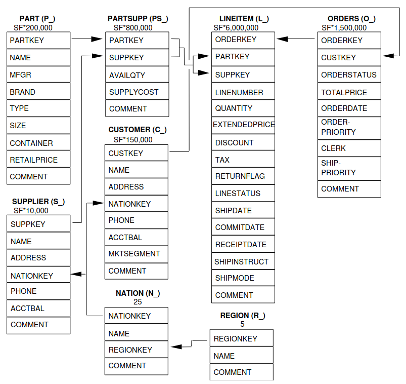

# How to build a graph from relational tables

## Overview

- Basic how-to guide for learning to build a graph in Rel
- We will use TPC-H dataset, a well-known dataset and benchmark
- Import relational tables from CSV source
- Building a graph schema and populating the graph
- Asserting integrity constraints based on the schema
- Query the graph

## About TPC-H

TPC-H is a generic, business-oriented, decision-support benchmark with complex queries designed to examine large volumes of data and test concurrent data modification. The dataset is organized as a set of relational tables, each with one or two primary keys.



## Data ingestion

The first step is to ingest the data from a set of CSV source files. This data insertion step will provide the raw data which will populate the graph.
- review EDB ("data") vs IDB ("views") [link](https://docs.relational.ai/rel/concepts/updates)
- reference [CSV Import How-To Guide](https://docs.relational.ai/rel/how-to/csv-import)

### CSV import configuration

We need to specify a few configuration settings for each file: the path `:path` to the data source, number of header rows, and delimiter. The source csv files we use have no headers included. The header we provide will eventually be used to name our edge relations. Here is an example for the relational table concerning nations. Nation will be an entity type (a type of node on the graph) that is linked to Region, another entity type.

```
def nation_csv_config[:path] = "..."
def nation_csv_config[:syntax, :header_row] = 0
def nation_csv_config[:syntax, :delim] = '|'
def nation_csv_config[:syntax, :header] =
    (1, :nationkey);
    (2, :name);
    (3, :regionkey);
    (4, :comment)
```

We also specify the data type for each column.

```
def nation_csv_config[:schema] =
    (:nationkey, "int");
    (:name, "string");
    (:regionkey, "int");
    (:comment, "string")
```

### Data insertion

Data is inserted in a single declaration,

```
def insert[:nation] = load_csv[nation_csv_config]
```

> Note: In the Console, the configuration definitions and insert definition would be executed from an update cell. From the SDK, the code can be executed in a non-read-only query transaction.

Now the relation `nation` has been added as an EDB relation to the database.

How is `nation` organized? The relation `nation` is a Rel module containing relations named for each column in the source csv. Each relation is arity two, a single primary key which is shared by all entries in the same row of the csv, and the value of that column. 

[Add example data]

Conceptually, the `nation` module could be thought of as an RDF triple store in PSO order. The predicate P is the column name, which connects the subject S (the nation, represented by the primary key) and the object O (the value given by that column).

What actually is the primary key for an inserted CSV? Rel defaults to an internal data type called FilePos (File Position). Alternatively, one can use `lined_csv`,

```
def insert[:nation] = lined_csv[ load_csv[nation_csv_config] ]
```

and the primary key will be the row number in the original csv file. Importantly, there is no guarantee that either of these primary keys will be unique if you subsequently upload another csv file to update the `nation` relation. And therefore data may be unintentionally overwritten.

Because data modification is a component of this TPC-H benchmark, we need a primary key we can trust to be unique for any Nation entity instances added via future updates. The TPC-H dataset provides one, the `:nationkey` column.

We define a relation mapping the relation key from the FilePos to the primary key,

```
@inline
def set_primary_key[CSV][keycolumn][column](key, v)=
    CSV[keycolumn](pos, key) and
    CSV[column](pos, v)
    from pos

def insert[:nation] = set_primary_key[ load_csv[nation_csv_config] ][:nationkey]
```

Now the relation `nation` will be keyed by the value of the column `:nationkey`.

Some csv sources have more than one natural key. For the Line Item table, each row contains a unique combination of order key and line number. For the Part Supplier table, each row contains a unique combination of part key and supplier key. We define a similar relation `set_primary_twokey` to map these csv files to the two keys that uniquely define the LineItem entity instance and PartSupplier entity instance.

```
@inline
def set_primary_twokey[CSV][keycolumn1,keycolumn2][column](key1, key2, v) =
    CSV[keycolumn1](pos, key1) and
    CSV[keycolumn2](pos, key2) and
    CSV[column](pos, v)
    from pos

def insert[:partsupplier] = set_primary_twokey[ load_csv[partsupp_csv_config] ][:partkey,:suppkey]

def insert[:lineitem] = set_primary_twokey[ load_csv[lineitem_csv_config] ][:orderkey,:linenumber]
```

## Defining a graph schema

We now have a module for each csv table that contains relations keyed by the primary key(s) of the table. The schema follows exactly the ER diagram specified by the TPC-H standard. Already with this format we could compose queries. For example, the first TPC-H query introduces the concept of "charge". The charge calculation involves combining `revenue` and `tax` for each line item in an order.

```
def lineitem:charge[oid,line] = lineitem:revenue[oid,line] * 
                                ( dec[1] + lineitem:tax[oid,line] )
```

Here we've added the relation `charge` to the module `lineitem`. For each primary key (the order id `oid` and line number `line`) we define a `charge` value.

But to go beyond simple queries and take advantage of Rel's knowledge graph capabilities, we need to go beyond the relational table paradigm  and compose a true graph schema.

A graph in Rel is defined in the scope of a single module, with unary relations for each node and binary (or higher) arity relations for edges (hyperedges). All graph data is encoded as either a node or an edge connecting nodes, including the properties of nodes and edges.

### Nodes

One of the first steps in defining a graph schema is to ask, what should be the nodes of our graph? Each node represents a "thing" in our schema. A node may actually represent a physical thing, like a Part, but more likely it represents an abstracted concept, such as a Customer or Supplier, which may actually encompass a person/people or company. As we will see, some nodes may not translate to concrete "things" at all, in our worldview. But nonetheless treating these abstractions as nodes is useful for understanding how our data is connected.

For data structured as relational tables, we can easily assume that any concept that is referenced by one or more unique keys should be a node on our graph. The ER diagram for TPC-H has already done much of the work for us: the entities defined there are natural nodes in our graph.

Certain node properties are also good candidates for representation as an entity type.
- properties with few values (categorical data)
- In TPC-H: return flag, status, priority

The nodes of a RAI graph can have two types, "entity" or "value". The entities in an ER diagram, and any node that would be identified by a key, is an entity type. Nodes that contain data, or properties of nodes, would be represented as a RAI value type node. Yes, properties of nodes are represented as nodes in their own right. We'll see how that works in practice when we populate our TPC-H graph.

[Introduce Entity and Value ORM diagram representation]

### Edges

- Connect entities together
- Connect entities to values (this is how we represent node properties)
- Connect entity pairs or entity/value pairs to values (hyperedges, this is how we represent edge properties)

## Populating the graph

### Nodes: Entity definitions

Our set of modules are each keyed by a primary key that is unique for that module. But in TPC-H, these are simple integers, and two modules may use the same keys to represent different nodes.

### Edges: connecting entities

### Hyperedges

### Metadata

## Querying the graph